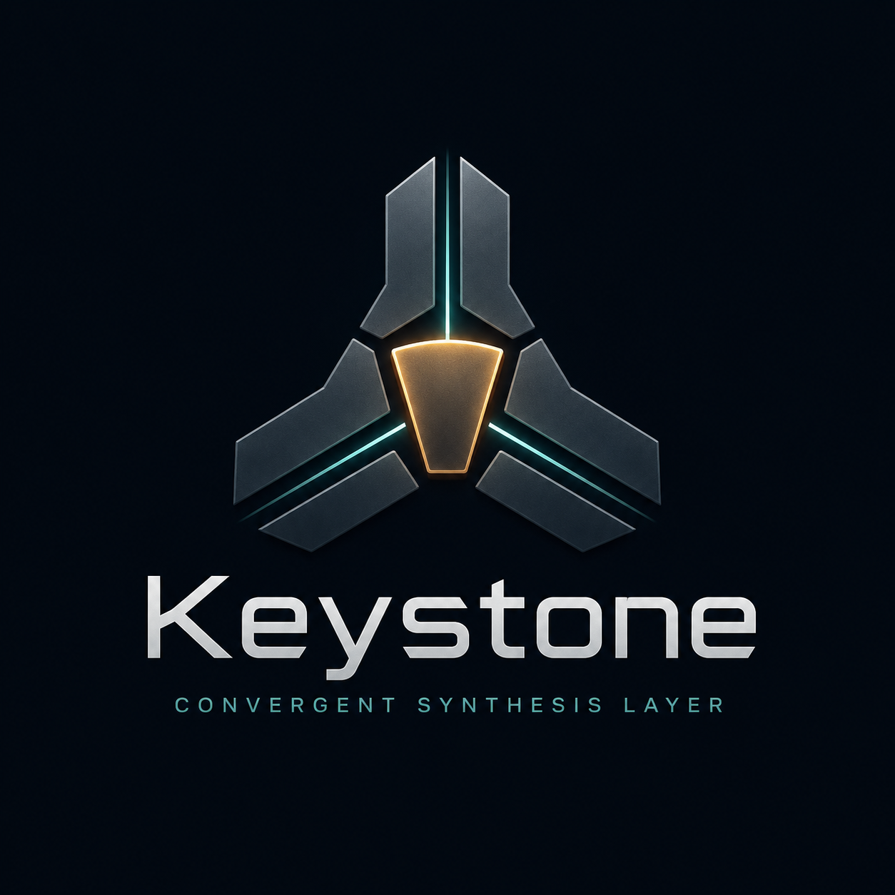

<p align="center">
  

  
</p>

<h1 align="center">🗝️ Keystone</h1>

<p align="center"><em>The last stone — the one that locks the arch and makes it bear weight.</em></p>

Keystone is the capstone of the meta-bridge stack. Underneath it, a corpus of
consciousness literature — Seth, the Ra material, Dolores Cannon, Bashar, the Nag
Hammadi library, neurobiology texts, and more — has already been ingested,
reflected on, mapped, and adversarially critiqued across a pile of Qdrant
collections. Keystone performs the one operation none of those layers can on their
own: it **triangulates them into a small, cross-validated canon** and lets the
machine finally state its own theses — each with a confidence number attached.

```
                          meta_reflections   ·   misfit_reports
                                   \                /
                                    \              /
   concept themes (cross-source)  →  KEYSTONE  →  keystones
                                    /              \
                              breadth            R1 + Gemma
                          (convergence)         (forge + gate)
```

---

## The idea in one paragraph

A claim is only worth canonizing when independent lines of evidence agree on it.
Keystone takes every **concept** that appears across the corpus, keeps the ones that
show up in *many different sources*, and scores each on three axes: how broadly the
traditions converge on it (**breadth**), how tightly the passages about it actually
cohere (**coherence**), and whether it survived the MisfitCrew's adversarial critique
(**survival**). Multiply those together and you get a single number — **convergence** —
that says how strongly the whole corpus, read three ways at once, stands behind the
idea. The survivors get handed to a reasoning model that writes the canonical thesis,
a critic that guards against overreach, and the result is embedded back into Qdrant as
a first-class, queryable layer.

> **Convergence-as-evidence, made computable.** When 43 independent traditions land on
> *post-mortem survival of consciousness*, that agreement isn't a vibe anymore — it's a
> score.

---

## What it actually forges

A real keystone from the corpus, cross-validated across **113 sources**:

> **`soul`** — *"Soul is eternal essence trapped in matter but liberated through ethics
> and gnosis."*
> `convergence 0.76 · 113 sources · R1 forged · Gemma passed`

Gnostic entrapment, dharmic liberation, the ethics-plus-knowledge path — one sentence
synthesizing a hundred traditions, with full provenance back to every reflection and
source that supports it. Other theses at the top of the canon: *non-locality of
consciousness* (43 sources), *divine monism*, *tripartite nature*, *microcosm–macrocosm
analogy*, *consciousness persistence*, *post-mortem judgment*.

---

## The convergence score

```
convergence = centrality**W_c  ·  coherence**W_s  ·  survival**W_v
```

Multiplicative on purpose: a zero in any single axis tanks the whole score, because a
claim that fails one lens has no business being canon.

| Axis | Means | Computed from |
|------|-------|---------------|
| **centrality** | cross-tradition breadth | `min(1, n_sources / SOURCE_SATURATION)` — how many distinct sources carry the concept |
| **coherence** | semantic tightness | mean cosine of member reflections to their centroid, with a **verbatim guard** (see below) |
| **survival** | adversarial validity | mean MisfitCrew rubric: `(consistency + validity) / 2 · (1 − drift)`, neutral `0.6` if unreviewed |

### The verbatim guard (a lesson learned the hard way)

Early runs ranked **Project Gutenberg license boilerplate** at the very top —
`derivative works`, `trademark license`, `digital distribution`. Why? That text is
*byte-identical* across every book, so its reflections cluster at near-perfect
coherence. Raw coherence rewards copy-paste and **penalizes genuine cross-tradition
convergence**, where the same idea shows up in wildly different vocabulary. So
coherence above `VERBATIM_CEIL` (0.93) gets docked hard — suspiciously identical text
is repetition, not agreement. The boilerplate is also stopworded out entirely.

---

## Pipeline

```
harvest  →  score  →  [convergence gate]  →  forge (R1)  →  critic (Gemma)  →  write
```

- **harvest** — scan every reflection, group by normalized concept, keep themes that
  span ≥ `MIN_SOURCES` distinct sources with ≥ `MIN_MEMBERS` reflections. Then the key
  trick: **prune by breadth before hydrating.** Since coherence and survival are both
  ≤ 1, a theme's *maximum possible* convergence is its centrality alone — so anything
  whose breadth can't reach the gate is dropped without ever pulling a vector. Lossless,
  and it turns a 14-minute scan into seconds.
- **score** — centrality × coherence × survival, per theme.
- **forge** — DeepSeek R1 states the single canonical thesis the theme is asserting,
  anchored only in the member reflections and named cross-tradition convergence.
- **critic** — Gemma gates it: `pass` / `revised` / `reject`. Overreach and mysticism-
  as-insight die here.
- **write** — embed the statement, upsert to `keystones` with a stable SHA-256 id and
  full provenance (concept, component scores, member reflection ids, source ids, model).

The `keystones` collection is embedded with the same model as the corpus, so it's
immediately retrievable — **Eli GPT, Awakening Mind GPT, and the Chat Bridge personas
can stop reasoning from raw literature and start speaking from the canon.**

---

## Corpus at a glance (current run)

```
221,051 reflections   scanned
158,682 concepts      distinct
 16,256 themes        span ≥ 3 sources
  3,381 themes        can reach the 0.75 gate (breadth prune skips the other 12,875)
    344 keystones     clear convergence ≥ 0.75  ← the canon
```

The histogram draws its own cut line: a pileup at 0.70–0.75, then a cliff to ~344 above
0.75. That gap *is* the boundary of the canon.

---

## Install

```bash
git clone https://github.com/meistro57/keystone
cd keystone
./setup.sh                 # venv + deps, copies .env.example → .env
```

Then edit `.env` — add your keys and confirm the collection names match your Qdrant.

## Usage

```bash
# 1. Look before you forge — scores everything, writes nothing, no LLM calls
python run.py --dry-run

#    Prints a convergence histogram + a gate table:
#      gate 0.70 → 1804 keystones
#      gate 0.75 →  344 keystones   ← pick your cut
#      gate 0.80 →    1

# 2. Taste-test the top of the canon (top N by convergence)
python run.py --limit 10

# 3. Forge the full canon at the chosen gate
python run.py                        # uses MIN_CONVERGENCE from .env
python run.py --min-convergence 0.75 # or override inline
```

Not sure your payload fields match? `python probe.py` dumps the real schema of every
collection so you can map `config.py` to reality.

---

## LLM routing

Everything is OpenAI-compatible and configured in `.env`.

- **Synthesis (R1)** — routes through OpenRouter by default. Set `DEEPSEEK_API_KEY` and
  it goes **straight to DeepSeek** (`deepseek-reasoner`) instead — cheaper and faster,
  which matters across a few hundred forges. Blank key = OpenRouter fallback, no code
  change.
- **Critic (Gemma)** — OpenRouter.
- **Embeddings** — `gemini-embedding-001` (3072d) to match the corpus. Point
  `EMBED_BASE_URL` wherever your embeddings actually live.

---

## Config reference (`.env`)

| Key | Default | Purpose |
|-----|---------|---------|
| `REFLECTIONS_COLLECTION` | `meta_reflections` | source of concepts + summaries |
| `MISFIT_COLLECTION` | `misfit_reports` | adversarial rubric (joined by **shared point id**) |
| `KEYSTONES_COLLECTION` | `keystones` | output canon |
| `REFLECTION_VECTOR_NAME` | `summary_vec` | named vector used for coherence |
| `MIN_MEMBERS` / `MIN_SOURCES` | `6` / `3` | theme qualification floor |
| `SOURCE_SATURATION` | `20` | breadth at which centrality maxes to 1.0 |
| `VERBATIM_CEIL` / `VERBATIM_PENALTY` | `0.93` / `0.4` | boilerplate guard |
| `SURVIVAL_NEUTRAL` | `0.6` | score for unreviewed members |
| `MIN_CONVERGENCE` | `0.75` | the gate — also drives the breadth prune |
| `STOP_CONCEPTS` | *(generic + license boilerplate)* | concepts too broad to be a thesis |
| `SYNTH_MODEL` / `SYNTH_MODEL_DIRECT` | `deepseek/deepseek-r1` / `deepseek-reasoner` | R1 via OpenRouter / DeepSeek-direct |
| `CRITIC_MODEL` | `google/gemma-2-27b-it` | the gate model |

---

## A keystone's provenance

Every point in `keystones` carries the receipts:

```json
{
  "concept": "soul",
  "statement": "Soul is eternal essence trapped in matter but liberated through ethics and gnosis.",
  "one_liner": "...",
  "convergence": 0.7608,
  "centrality": 1.0, "coherence": 0.88, "survival": 0.91,
  "n_sources": 113,
  "member_reflection_ids": ["...", "..."],
  "source_ids": ["the_ra_contact_volume_1", "..."],
  "critic_verdict": "pass",
  "model": "deepseek-reasoner + google/gemma-2-27b-it"
}
```

Nothing is asserted without a chain back to the reflections and sources that earned it.

---

## Roadmap

- [ ] **Parallel forge** — `ThreadPoolExecutor` around the R1 loop; turns a ~5-hour
      sequential run into well under one (writer already uses stable ids, so concurrent
      upserts are safe).
- [ ] **Keystone Lens** — Bubbletea TUI to browse the canon by convergence score.
- [ ] **Lewis command** — `keystone forge` triggerable from Discord.
- [ ] **Canon retrieval tier** — wire `keystones` into ArchiMind / FrontPocket / Chat
      Bridge as a priority layer above raw reflections.
- [ ] **Recursive pass** — run the Vectoreologist *on the keystones themselves*: the
      topology of the canon.

---

## License

MIT — Mark Hubrich ([@meistro57](https://github.com/meistro57))

*Part of the meta-bridge ecosystem: KAE · Meta Bridge · Vectoreologist · MisfitCrew ·
FrontPocket · Chat Bridge · **Keystone**.*
